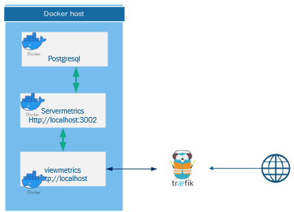

# ServerMetrics

## Projet Metrics

Le projet metric est un projet experimental permettant de mettre en oeuvre différentes techniques

- Nodejs et prisma pour le serveur d'api
- Vuejs 3 en typescript pour le viewer
- Traefik et docker pour l'hebergement des sites et base de données

## ServerMetrics

ce projet mets en oeuvre NodeJs, Prisma comme ORM et Postgresql pour stocker les métrics

- cpu
- memoire
- disque
- status des containers docker

Les métrics sont enregistrés toutes les 5 secondes via node-schedule
